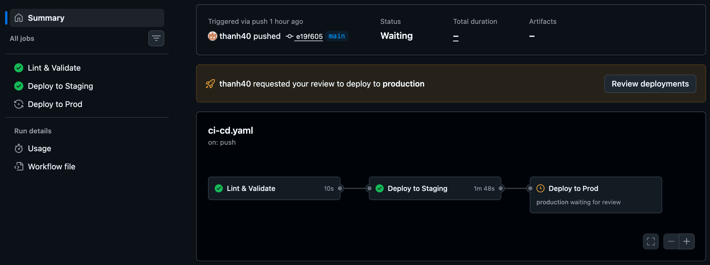
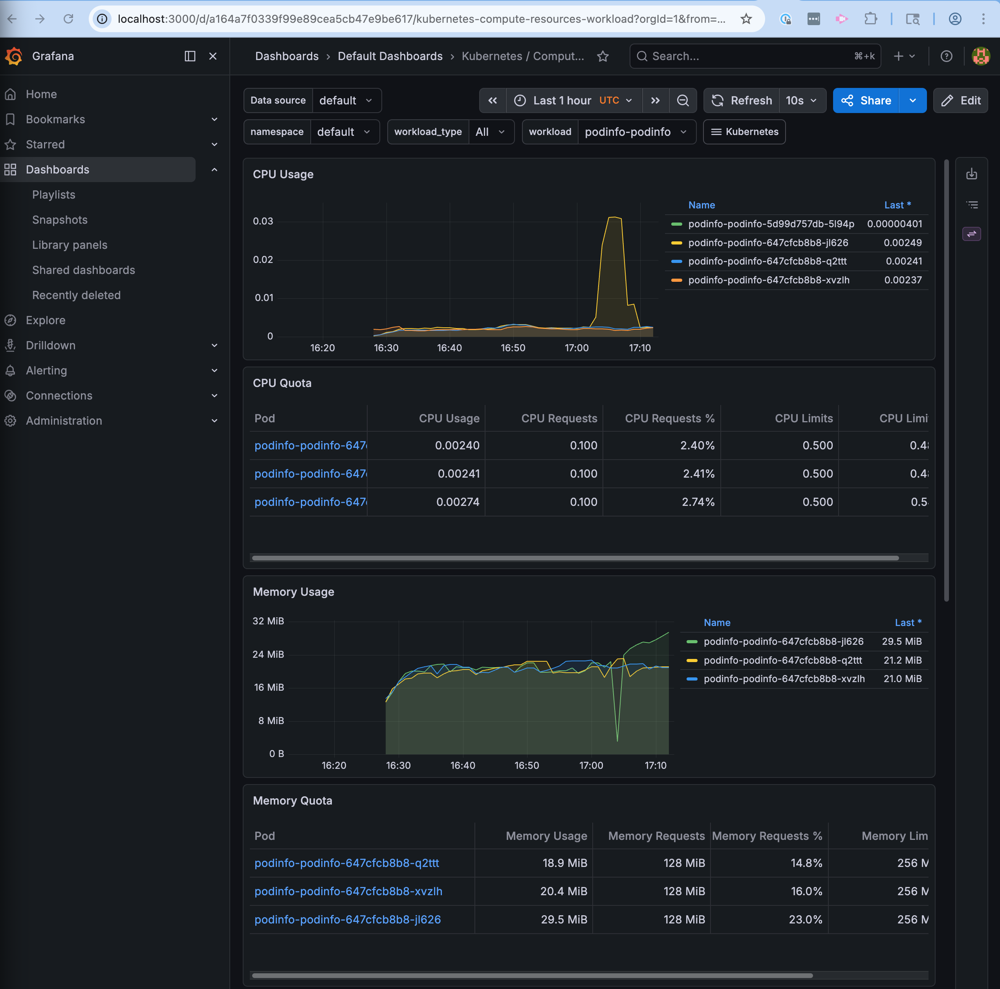
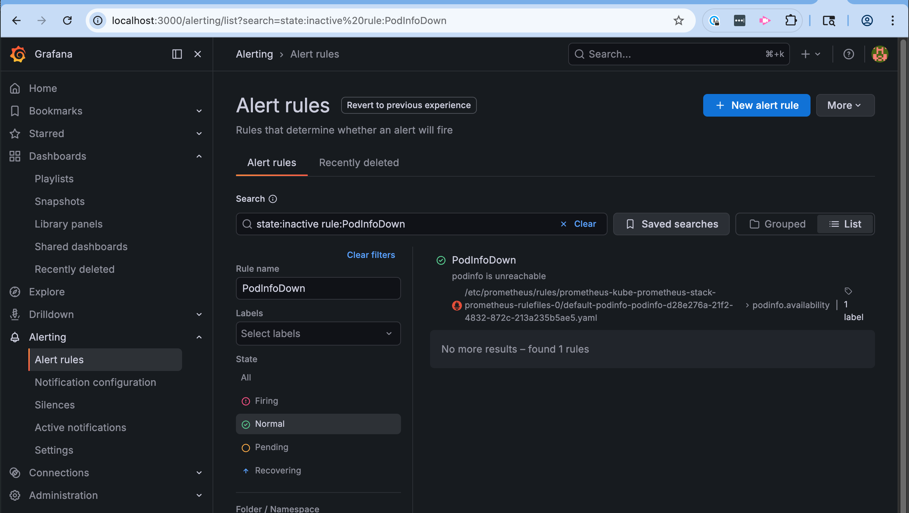

# podinfo — Helm, CI/CD, and observability on Kubernetes

Local Kubernetes deployment of [stefanprodan/podinfo](https://github.com/stefanprodan/podinfo) with a production-grade Helm chart, GitHub Actions CI/CD pipeline, and Prometheus/Grafana observability stack.

## Prerequisites

- macOS with [Homebrew](https://brew.sh)
- A GitHub account (for CI/CD)

All other tools (Docker Desktop, kind, kubectl, helm) are installed by the setup script.

## Quick Start

Provision, deploy, and verify everything in one command:

```bash
make
```

Or step by step:

```bash
make cluster                       # install tools, create kind cluster
make deploy-kube-prometheus-stack  # Prometheus + Grafana
make deploy-podinfo                # podinfo
make verify                        # smoke test /healthz
make verify-alert                  # trigger and confirm PodInfoDown alert fires
```

**Access Grafana**

```bash
# Grafana  (admin / admin)
kubectl port-forward -n monitoring svc/kube-prometheus-stack-grafana 3000:80
open http://localhost:3000
```

When done:

```bash
make teardown                      # delete cluster
```

> [!NOTE]
> If Docker Desktop was just installed, open it from Applications, wait for it to finish starting, then re-run.

## CI/CD Pipeline

The pipeline has four jobs, all using the same Makefile targets as local development:

| Job | Trigger | What it does |
|-----|---------|-------------|
| `lint-and-validate` | every push | `make lint` — lints and template-validates both charts |
| `deploy-ephemeral` | PR or manual (`workflow_dispatch`) | deploys to an ephemeral kind cluster, runs `make verify` |
| `deploy-staging` | push to `main` | deploys to an ephemeral kind cluster, runs `make verify` |
| `deploy-prod` | after staging + manual approval | deploys with prod values, auto-rollback on failure |

**Setting up the manual approval gate:**

1. Go to **Settings → Environments → New environment**, name it `production`
2. Enable **Required reviewers** and add yourself
3. Any merge to `main` will pause at `deploy-prod` until a reviewer approves



## Incident Response: podinfo unreachable at 2am

*Scenario: PodInfoDown alert fires — the service has been unreachable for 3 minutes.*

The alert comes from `kube_deployment_status_replicas_available == 0`, so the first question is whether this is a pod failure, a network issue, or a bad deploy. The goal in the first two minutes is to establish which path we're on before taking any action — rolling back the wrong thing or bumping resources blindly wastes time and can make things worse.

1. Check if the pods themselves are healthy:
```
kubectl get pods -n default -l app.kubernetes.io/name=podinfo
  ⎿  NAME                               READY   STATUS             RESTARTS        AGE
     podinfo-podinfo-7d895d4bfb-f7mh4   0/1     CrashLoopBackOff   5 (2m10s ago)   5m12s
     podinfo-podinfo-7d895d4bfb-kk79k   0/1     CrashLoopBackOff   5 (2m13s ago)   5m12s
     podinfo-podinfo-7d895d4bfb-w929s   0/1     CrashLoopBackOff   5 (2m1s ago)    5m12s
```

2. Check helm history — if there was a recent deploy, roll back immediately:
```
helm history podinfo -n default
  ⎿  REVISION   UPDATED                         STATUS       CHART           APP VERSION   DESCRIPTION
     1          Sat Apr 25 09:26:53 2026        superseded   podinfo-0.1.0   6.7.0         Install complete
     2          Sat Apr 25 10:15:40 2026        deployed     podinfo-0.1.0   6.7.0         Upgrade complete
```
`helm rollback podinfo 0` rolls back to the previous revision — confirm it was healthy in the history before running.

3. Check the Grafana RED dashboard to establish a timeline — did traffic drop suddenly (crash or bad deploy) or gradually (resource exhaustion)?



4. Check the last state of a crashing pod to identify the root cause:
```
kubectl describe pod -n default podinfo-podinfo-647cfcb8b8-jl626 | grep -A5 "Last State"
  ⎿      Last State:     Terminated
           Reason:       OOMKilled
           Exit Code:    137
```

OOMKilled (exit code 137) means the container exceeded its memory limit. The fix is to increase the limit and redeploy — a rollback only helps if a previous revision had a higher limit.

5. Increase the memory limit and redeploy:
```
helm upgrade podinfo helm/podinfo --namespace default --reuse-values --set resources.limits.memory=512Mi --wait
  ⎿  Release "podinfo" has been upgraded. Happy Helming!
     STATUS: deployed
     REVISION: 4
```

6. Verify all pods are back up:
```
kubectl get pods -n default -l app.kubernetes.io/name=podinfo
  ⎿  NAME                               READY   STATUS    RESTARTS   AGE
     podinfo-podinfo-647cfcb8b8-8mdqb   1/1     Running   0          47s
     podinfo-podinfo-647cfcb8b8-dgr8b   1/1     Running   0          34s
     podinfo-podinfo-647cfcb8b8-pxsrl   1/1     Running   0          21s
```

7. Confirm the alert has resolved in Prometheus/Alertmanager:



8. Backfill the manually increased settings.

## Decisions & Reflections

1. **Makefile as the single interface** — all operations (local dev and CI) go through the same Makefile targets. Engineers can reproduce any CI step locally with the same command. Wiring `make verify-alert` to actually fire a Prometheus alert found a real timing bug (fixed the polling loop) — manual checks would have missed it.

2. **`values.yaml` + `values-prod.yaml`** — prod overrides replicas for zone redundancy and widens resource limits for traffic headroom. `topologySpreadConstraints` with `ScheduleAnyway` spreads pods across nodes and AZs on a best-effort basis — availability over strict placement guarantees.

3. **Helm scripting and GitOps aren't either/or** — Helm gives reproducible, diffable deploys; ArgoCD gives visual management and drift detection. The right answer is both: Helm renders, ArgoCD applies.

4. **AI-assisted infrastructure work** — used Claude to accelerate the tedious parts: generating PromQL queries, debugging timing issues in the alert test, and simulating the 2am incident to validate the runbook against real cluster behavior. The value wasn't in writing the config — it was in tightening the feedback loop between idea and verification.

## What I'd Do Next

1. **Managed observability** — replace in-cluster Prometheus and Grafana with Amazon Managed Service for Prometheus (AMP) and Amazon Managed Grafana (AMG). Eliminates storage management and retention limits inside the cluster, and allows longer metric windows (months vs the 30-day cap practical for in-cluster storage) without scaling Prometheus infrastructure.
2. **Alertmanager routing** — wire `PodInfoDown` (critical) to PagerDuty and `PodInfoHighErrorRate`/`PodInfoHighLatency` (warning) to Slack; currently alerts fire in Prometheus but go nowhere.
3. **GitOps promotion** — replace the GitHub Environments gate with ArgoCD + Kargo: CI publishes a new image tag, Kargo promotes it through environments based on Prometheus success metrics (error rate, latency), eliminating the manual approval step for routine deploys.
